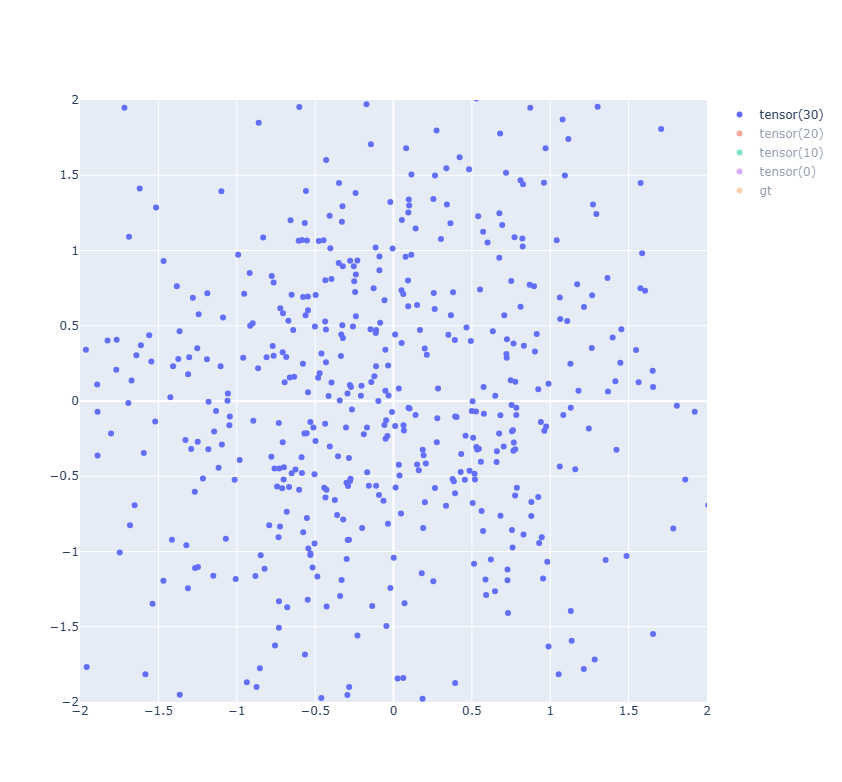
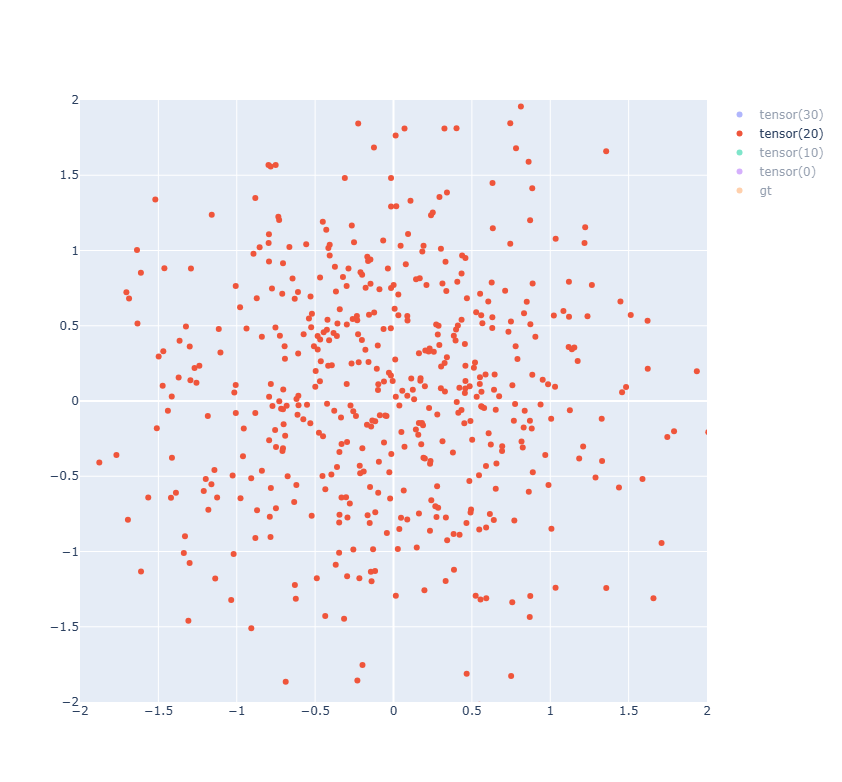
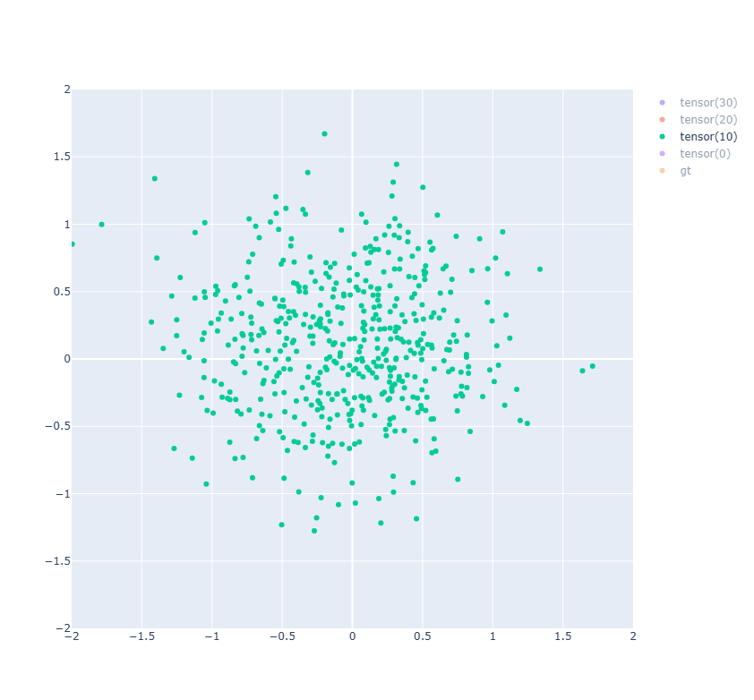
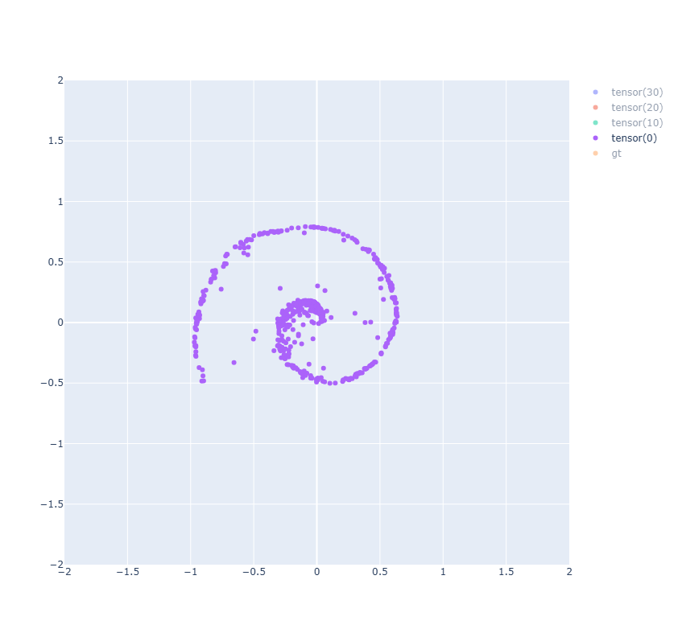
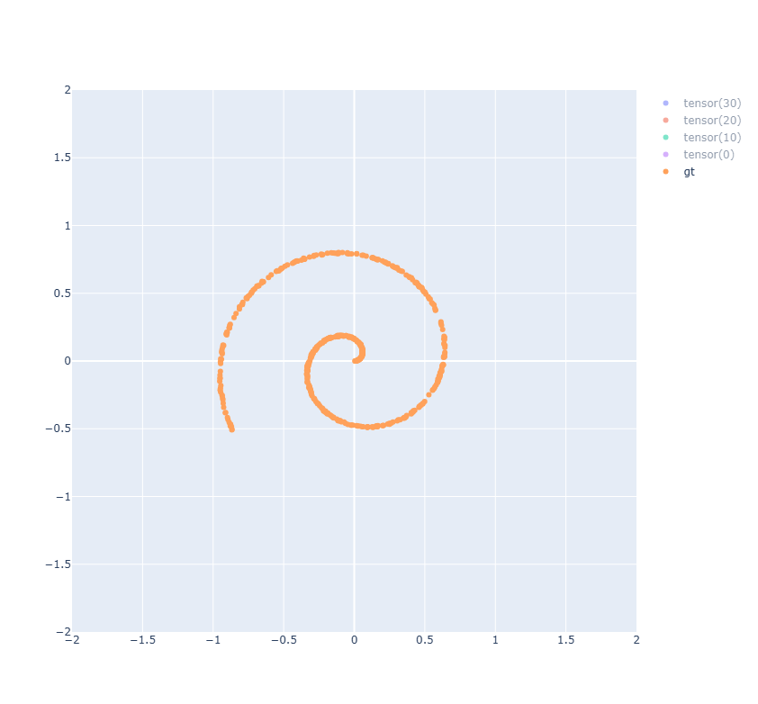

# Introduction

A toy diffusion model that contains implementations for [DDPM](https://arxiv.org/abs/2006.11239) and [DDIM](https://arxiv.org/abs/2010.02502), all in one file!

# Requirements
```bash
torch
plotly
```

# Usage
```bash
# for model training, weights are saved to model.weights
python3 main.py train ddpm

# for model infer, load weights from model.weights
python3 main.py infer ddpm
```

# Results

| time step | 30 | 20    |  10    |  00   |  gt  |
| :----: | :----: | :----:    | :----:    |:----:   |:------:|
| results | ||  |||
